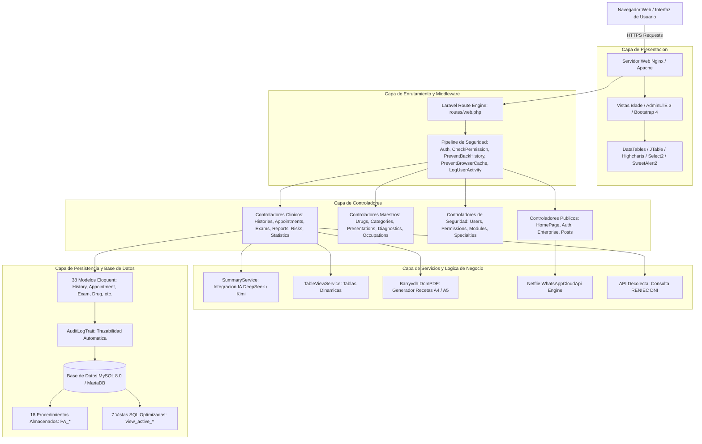
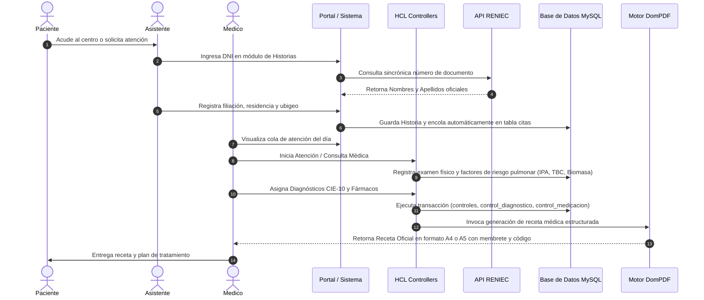

# PDR — Documento de Definición de Producto y Reporte de Arquitectura del Sistema

**Sistema:** Neumo-LAV / Neumotar (Gestión de Historias Clínicas Electrónicas, Diagnósticos Neumológicos y Salud Ocupacional)  
**Versión del Sistema:** 2.0 (Edición Corporativa)  
**Entorno Tecnológico:** PHP 8.1+ / Laravel Framework 10.x / MySQL 8.0+ / MariaDB / AdminLTE 3 / Bootstrap 4  
**Entidad Propietaria:** Medytarq SAC (RUC: 20605677593)  
**Establecimiento:** Jr. Paraguay 136, Tarapoto, San Martín, Perú  

> Nota de Ubicación: La versión canónica de este documento técnico se encuentra alojada en [`docs/PDR.md`](docs/PDR.md).

---

## Índice de Contenidos

- [1. Introducción y Visión General del Producto](#1-introducción-y-visión-general-del-producto)
  - [1.1 Propósito y Justificación](#11-propósito-y-justificación)
  - [1.2 Alcance Funcional y Clínico](#12-alcance-funcional-y-clínico)
  - [1.3 Perfiles de Usuario y Modelo de Roles (RBAC)](#13-perfiles-de-usuario-y-modelo-de-roles-rbac)
- [2. Arquitectura Tecnológica y Patrones de Diseño](#2-arquitectura-tecnológica-y-patrones-de-diseño)
  - [2.1 Diagrama de Arquitectura de Capas](#21-diagrama-de-arquitectura-de-capas)
  - [2.2 Flujo del Proceso de Atención Médica](#22-flujo-del-proceso-de-atención-médica)
  - [2.3 Pila Tecnológica y Dependencias Principales](#23-pila-tecnológica-y-dependencias-principales)
- [3. Capa de Seguridad, Autenticación y Auditoría](#3-capa-de-seguridad-autenticación-y-auditoría)
  - [3.1 Control de Acceso y Pipeline de Middleware](#31-control-de-acceso-y-pipeline-de-middleware)
  - [3.2 Mecanismo Anti Fuerza Bruta y Protección de Sesión](#32-mecanismo-anti-fuerza-bruta-y-protección-de-sesión)
  - [3.3 Sistema de Trazabilidad y Auditoría Transaccional](#33-sistema-de-trazabilidad-y-auditoría-transaccional)
- [4. Especificación Detallada de Módulos y Controladores](#4-especificación-detallada-de-módulos-y-controladores)
  - [4.1 Módulo Clínico: Historia Clínica Electrónica (HCL)](#41-módulo-clínico-historia-clínica-electrónica-hcl)
  - [4.2 Módulo Clínico: Controles Médicos y Recetas](#42-módulo-clínico-controles-médicos-y-recetas)
  - [4.3 Módulo Clínico: Exámenes Auxiliares e Imágenes](#43-módulo-clínico-exámenes-auxiliares-e-imágenes)
  - [4.4 Módulo Clínico: Informes Médicos](#44-módulo-clínico-informes-médicos)
  - [4.5 Módulo Clínico: Informes de Riesgo Quirúrgico](#45-módulo-clínico-informes-de-riesgo-quirúrgico)
  - [4.6 Módulo Estadístico y Analítica Epidemiológica](#46-módulo-estadístico-y-analítica-epidemiológica)
  - [4.7 Módulo de Mantenimiento y Catálogos Maestros](#47-módulo-de-mantenimiento-y-catálogos-maestros)
  - [4.8 Módulo de Seguridad y Administración de Usuarios](#48-módulo-de-seguridad-y-administración-de-usuarios)
  - [4.9 Módulo de Gestión Empresarial y Contenidos](#49-módulo-de-gestión-empresarial-y-contenidos)
  - [4.10 Módulo Web Público y Portal de Pacientes](#410-módulo-web-público-y-portal-de-pacientes)
- [5. Servicios Especializados e Integraciones Externas](#5-servicios-especializados-e-integraciones-externas)
  - [5.1 Integración RENIEC (Consulta DNI en Tiempo Real)](#51-integración-reniec-consulta-dni-en-tiempo-real)
  - [5.2 Motor de Notificaciones WhatsApp Cloud API](#52-motor-de-notificaciones-whatsapp-cloud-api)
  - [5.3 Servicio de Resumen Automatizado con IA (DeepSeek / Kimi AI)](#53-servicio-de-resumen-automatizado-con-ia-deepseek--kimi-ai)
  - [5.4 Motor de Generación e Impresión de Recetas PDF (A4 y A5)](#54-motor-de-generación-e-impresión-de-recetas-pdf-a4-y-a5)
- [6. Diccionario de Datos y Modelos Eloquent](#6-diccionario-de-datos-y-modelos-eloquent)
- [7. Catálogo de Procedimientos Almacenados y Vistas SQL](#7-catálogo-de-procedimientos-almacenados-y-vistas-sql)
  - [7.1 Procedimientos Almacenados (Stored Procedures)](#71-procedimientos-almacenados-stored-procedures)
  - [7.2 Vistas de Base de Datos](#72-vistas-de-base-de-datos)
- [8. Matriz Integral de Rutas del Sistema](#8-matriz-integral-de-rutas-del-sistema)
- [9. Despliegue, Respaldos y Mantenimiento Operativo](#9-despliegue-respaldos-y-mantenimiento-operativo)
  - [9.1 Variables de Entorno Requeridas](#91-variables-de-entorno-requeridas)
  - [9.2 Política y Ejecución de Respaldos de Base de Datos](#92-política-y-ejecución-de-respaldos-de-base-de-datos)

---

## 1. Introducción y Visión General del Producto

### 1.1 Propósito y Justificación
El sistema **Neumo-LAV** (denominado comercialmente en la atención al paciente como **Neumotar**) es una solución informática de alta especialización concebida para la gestión médica, clínica, epidemiológica y administrativa del centro especializado en neumología y salud respiratoria operado por la empresa **Medytarq SAC**.

El sistema da respuesta a los desafíos operativos y normativos del sector salud en el Perú (directivas del Ministerio de Salud - MINSA):
- Eliminación del soporte físico de historias clínicas y mitigación del riesgo de pérdida o deterioro documental.
- Estandarización de diagnósticos mediante el catálogo internacional **CIE-10**.
- Cálculo automatizado y objetivo de índices de riesgo tabáquico (**Índice Paquete Año - IPA**).
- Detección sistemática y registro de exposición a factores ambientales de la Amazonía peruana (humo de biomasa, leña, contacto con tuberculosis - TBC, antecedentes de COVID-19 y polvos ocupacionales).
- Trazabilidad total de la prescripción farmacológica y expedición inmediata de recetas médicas en formatos estándar **A4** y de medio pliego **A5** con códigos de control, membrete institucional y firma digitalizada del médico especialista.

### 1.2 Alcance Funcional y Clínico
La plataforma abarca la totalidad del ciclo de atención del paciente ambulatorio y ocupacional:
1. **Admisión y Filiación Demográfica:** Registro de identidad asistido por consulta sincrónica a la base de datos de **RENIEC**, codificación geográfica normalizada mediante el estándar nacional de **Ubigeo** (departamento, provincia, distrito) y codificación de ocupación según la Clasificación Internacional Uniforme de Ocupaciones (**CIUO**).
2. **Historia Clínica Neumológica (HCL):** Anamnesis completa, tiempo de enfermedad, síntomas cardinales respiratorios (tos, disnea, dolor torácico, expectoración, hemoptisis), antecedentes mórbidos personales (asma bronquial, EPOC, EPID, tuberculosis, cáncer de pulmón, efusión pleural, neumonías recurrentes) y quirúrgicos.
3. **Controles y Consultas Médicas:** Registro evolutivo de cada cita médica, evaluación de signos vitales, asociación de múltiples diagnósticos CIE-10, formulación posológica de medicamentos y emisión de recetas.
4. **Exámenes Auxiliares de Diagnóstico:** Gestión de órdenes y resultados de pruebas diagnósticas (Espirometrías basales y con broncodilatador, Tomografía Axial Computarizada - TAC de tórax, Radiografías simples, Test de Asma) con almacenamiento y visor de imágenes radiológicas y trazados espirométricos.
5. **Informes Médicos e Informes de Riesgo:** Emisión de dictámenes clínicos oficiales, evaluaciones de riesgo quirúrgico neumológico y cardiovascular preoperatorio.
6. **Analítica Epidemiológica y Estadísticas:** Tableros de control ejecutivos que presentan en tiempo real tendencias temporales, distribución demográfica, morbilidad respiratoria y perfiles de consumo de medicamentos.
7. **Portal Web y Autoservicio de Citas:** Módulo de atención al usuario final que permite la lectura de artículos médicos y la solicitud de citas en línea con notificación vía WhatsApp Cloud API y correo electrónico.

### 1.3 Perfiles de Usuario y Modelo de Roles (RBAC)
El sistema implementa el paquete `spatie/laravel-permission` estructurado en una matriz de tres roles institucionales:

| Rol | Identificador | Nivel de Acceso y Funciones |
| :--- | :--- | :--- |
| **Administrador** | `administrador` | Acceso global irrestricto. Gestión de usuarios, asignación de roles y permisos granulares, configuración institucional, catálogo de módulos y submódulos dinámicos, gestión de backups del sistema y acceso a todos los submódulos clínicos. |
| **Especialista** | `especialista` | Perfil médico (Neumólogo / Médico Cirujano). Acceso integral al circuito clínico: apertura y edición de historias clínicas, consultas y controles, exámenes auxiliares, carga de imágenes diagnósticas, emisión de informes clínicos y de riesgo quirúrgico, prescripción de recetas y consulta del dashboard estadístico. Restringido para administración de usuarios y seguridad. |
| **Asistente** | `asistente` | Personal asistencial y de recepción. Permiso de consulta y creación (`ver`, `crear`) de admisiones de pacientes, asignación de citas en cola diaria y confirmación de turnos. Restringido para modificación de diagnósticos médicos, prescripción de medicamentos y anulación de registros. |

---

## 2. Arquitectura Tecnológica y Patrones de Diseño

### 2.1 Diagrama de Arquitectura de Capas



### 2.2 Flujo del Proceso de Atención Médica



### 2.3 Pila Tecnológica y Dependencias Principales

| Categoría | Tecnología / Paquete | Versión | Propósito en la Solución |
| :--- | :--- | :--- | :--- |
| **Lenguaje Core** | PHP | `^8.1` | Motor de ejecución del servidor con soporte de tipado estricto. |
| **Framework Web** | `laravel/framework` | `^10.10` | Arquitectura MVC, inyección de dependencias, Eloquent ORM y migraciones. |
| **Generador PDF** | `barryvdh/laravel-dompdf` | `^3.1` | Renderizado de documentos clínicos y recetas médicas (A4 / A5). |
| **Gestión de Permisos** | `spatie/laravel-permission` | `^6.21` | Implementación de RBAC en rutas, vistas y controladores. |
| **Copias de Seguridad** | `spatie/laravel-backup` | `^8.8` | Respaldo periódico programado de la base de datos y archivos multimedia. |
| **Notificaciones WhatsApp** | `netflie/whatsapp-cloud-api`| `^2.2` | Conexión directa a Meta Cloud API para confirmación de citas web. |
| **Cliente HTTP** | `guzzlehttp/guzzle` | `^7.2` | Consultas HTTP a la API de RENIEC y a las APIs de IA (DeepSeek / Kimi). |
| **Machine Learning** | `php-ai/php-ml` | `^0.10.0` | Utilidades de predicción y análisis algorítmico en PHP. |
| **Autenticación API** | `laravel/sanctum` | `^3.3` | Emisión de tokens de autenticación para servicios móviles/API. |
| **UI Framework** | AdminLTE | `v3.2` | Plantilla administrativa basada en Bootstrap 4. |
| **Gráficos Estadísticos** | Highcharts JS | `v10+` | Renderizado de gráficos interactivos, diagramas de barras y series de tiempo. |
| **Tablas Dinámicas** | DataTables & JTable | `v1.10+` | Renderizado de listados paginados por AJAX con filtros avanzados. |

---

## 3. Capa de Seguridad, Autenticación y Auditoría

### 3.1 Control de Acceso y Pipeline de Middleware
El archivo [`app/Http/Kernel.php`](file:///media/gercova/DATA1/PROYECTOS%20WEB/neumo-lav/app/Http/Kernel.php) configura la secuencia de filtros obligatorios para cada solicitud HTTP:

```
[Cliente HTTP]
       │
       ▼
[Global Stack: TrustProxies -> HandleCors -> PreventRequestsDuringMaintenance -> ValidatePostSize -> TrimStrings -> ConvertEmptyStringsToNull]
       │
       ▼
[Grupo 'web': EncryptCookies -> AddQueuedCookiesToResponse -> StartSession -> ShareErrorsFromSession -> VerifyCsrfToken -> SubstituteBindings]
       │
       ├─► [LogUserActivity] (Registra acceso en la tabla audit_logs)
       ├─► [PreventBrowserCacheAfterLogout] (Inyecta cabeceras No-Cache, No-Store, Must-Revalidate)
       │
       ▼
[Route Matching: Rutas protegidas bajo el prefijo /admin]
       │
       ├─► [auth] (Verifica sesión válida del usuario)
       ├─► [prevent.back] (Anula caché de historial del navegador para evitar navegar atrás post-logout)
       ├─► [role:administrador|especialista|asistente] (Verifica pertenencia al rol)
       └─► [permission:nombre_permiso] (Middleware personalizado CheckPermission)
```

#### Middleware `CheckPermission` ([`app/Http/Middleware/CheckPermission.php`](file:///media/gercova/DATA1/PROYECTOS%20WEB/neumo-lav/app/Http/Middleware/CheckPermission.php))
Permite evaluar listas de permisos utilizando separadores por coma o mediante el operador lógico pleca (`|`). Si el usuario autenticado posee al menos uno de los permisos declarados, se autoriza el paso; en caso contrario, se interrumpe la ejecución arrojando una excepción HTTP `403 (No tienes permiso para realizar esta acción)`.

#### Middleware `PreventBackHistory` y `PreventBrowserCacheAfterLogout`
Inyectan las cabeceras estándar de protección de privacidad médica en respuestas con contenido `text/html`:
```http
Cache-Control: no-cache, no-store, max-age=0, must-revalidate
Pragma: no-cache
Expires: Fri, 01 Jan 1990 00:00:00 GMT
```
Esto impide que una terminal compartida en el consultorio exponga historias clínicas o datos sensibles de pacientes al presionar el botón "Atrás" del navegador tras finalizar la sesión.

### 3.2 Mecanismo Anti Fuerza Bruta y Protección de Sesión
El controlador [`app/Http/Controllers/auth/AuthController.php`](file:///media/gercova/DATA1/PROYECTOS%20WEB/neumo-lav/app/Http/Controllers/auth/AuthController.php) resguarda el punto de entrada al sistema:
1. **Limitación de Tasa (Rate Limiting):** Se evalúa la llave criptográfica `throttleKey` conformada por la transliteración del correo electrónico y la dirección IP del cliente:
   ```php
   Str::transliterate(Str::lower($request->input('email')).'|'.$request->ip());
   ```
   Se autoriza un máximo de **5 intentos fallidos**. Superado dicho umbral, se bloquea la autenticación de manera progresiva por tiempo (`auth.throttle`).
2. **Filtrado de Usuarios Activos:** Se valida explícitamente que el usuario no cuente con una marca de baja lógica (`whereNull('deleted_at')`).
3. **Regeneración de Identificador de Sesión:** Tras validar las credenciales con `Auth::attempt()`, se ejecuta `$request->session()->regenerate()` para prevenir ataques de fijación de sesión (*Session Fixation*).
4. **Registro de Último Inicio de Sesión:** Se actualiza o crea un registro en la tabla `user_last_login` documentando la marca de tiempo `last_login` y la IP del cliente.
5. **Cierre de Sesión Seguro (`logout`):** Invalida completamente la sesión en el servidor (`$request->session()->invalidate()`) y regenera el token CSRF (`$request->session()->regenerateToken()`).

### 3.3 Sistema de Trazabilidad y Auditoría Transaccional
La solución cuenta con un subsistema dual de auditoría compuesto por:
1. **Auditoría de Accesos (`LogUserActivity`):** Registra cada petición procesada en el sistema, guardando el identificador del usuario, el nombre de la ruta o URI accedida, la IP y el User-Agent del navegador.
2. **Auditoría de Estado de Entidades (`AuditLogTrait`):** Aplicado a modelos críticos como `User` e `History`. Intercepta los eventos de Eloquent:
   - `created`: Guarda el registro nuevo (`new_data`).
   - `updated`: Almacena en formato JSON tanto el estado original (`old_data`) como los valores modificados, garantizando la inmutabilidad de la trazabilidad médico-legal.
   - `deleted`: Documenta la eliminación del registro con su estado previo a la baja lógica.

---

## 4. Especificación Detallada de Módulos y Controladores

### 4.1 Módulo Clínico: Historia Clínica Electrónica (HCL)
- **Controlador:** [`app/Http/Controllers/hcl/HistoriesController.php`](file:///media/gercova/DATA1/PROYECTOS%20WEB/neumo-lav/app/Http/Controllers/hcl/HistoriesController.php)
- **Modelo:** [`app/Models/History.php`](file:///media/gercova/DATA1/PROYECTOS%20WEB/neumo-lav/app/Models/History.php)
- **Validador:** [`app/Http/Requests/HistoryValidate.php`](file:///media/gercova/DATA1/PROYECTOS%20WEB/neumo-lav/app/Http/Requests/HistoryValidate.php)

El módulo centraliza la apertura y mantenimiento de la historia clínica médica:
- **Gestión Demográfica y RENIEC:** El método `searchDni(Request $request)` conecta con la API externa de RENIEC para autocompletar nombres completos y garantizar la fidelidad de la identidad del paciente.
- **Normalización Geográfica (Ubigeo):** Mediante `searchLocation(Request $request)`, el sistema realiza búsquedas compuestas sobre los 1,874 distritos del Perú unificando Departamento, Provincia y Distrito.
- **Evaluación de Factores de Riesgo Pulmonar:**
  - **Índice Paquete Año (IPA / Pack-Year Index):** Calcula la carga de tabaquismo mediante la fórmula clínica:
    $$\text{IPA} = \frac{\text{Cigarrillos al día} \times \text{Años fumando}}{20}$$
  - **Exposición a Biomasa:** Registro de años de exposición al humo de leña o carbón vegetal en cocina tradicional.
  - **Antecedentes Epidemiológicos:** Registro estructurado de contacto con tuberculosis (TBC), asma bronquial, enfermedad pulmonar obstructiva crónica (EPOC), enfermedad pulmonar intersticial difusa (EPID), cáncer pulmonar y neumonías previas.
- **Encolamiento Automático de Citas:** Al crear una nueva historia clínica (`isNew`), el sistema genera de forma transparente un registro en la tabla `citas` para la fecha actual, integrando al paciente en el flujo de atención del consultorio.

### 4.2 Módulo Clínico: Controles Médicos y Recetas
- **Controlador:** [`app/Http/Controllers/hcl/AppointmentsController.php`](file:///media/gercova/DATA1/PROYECTOS%20WEB/neumo-lav/app/Http/Controllers/hcl/AppointmentsController.php)
- **Modelos:** `Appointment`, `DiagnosticAppointment`, `MedicationAppointment`, `Enterprise`
- **Validador:** [`app/Http/Requests/AppointmentValidate.php`](file:///media/gercova/DATA1/PROYECTOS%20WEB/neumo-lav/app/Http/Requests/AppointmentValidate.php)

Gestiona las consultas médicas y revisiones periódicas:
- **Lógica Transaccional (`store`):** Utiliza transacciones de base de datos (`DB::beginTransaction() / DB::commit()`) para asegurar la atomicidad al guardar la consulta, los diagnósticos CIE-10 asociados y los medicamentos prescritos.
- **Prescripción Farmacológica:** Vincula medicamentos del catálogo maestro junto con su indicación posológica específica (dosis, vía de administración, frecuencia y duración).
- **Emisión de Receta Médica (`printPrescription`):** Produce el documento oficial en formato PDF mediante `Barryvdh\DomPDF`, permitiendo elegir entre **A4** (reporte formal extendido) o **A5** (recetario médico de mano), configurando márgenes de impresión exactos y vinculando la información de la empresa y del médico tratante.

### 4.3 Módulo Clínico: Exámenes Auxiliares e Imágenes
- **Controlador:** [`app/Http/Controllers/hcl/ExamsController.php`](file:///media/gercova/DATA1/PROYECTOS%20WEB/neumo-lav/app/Http/Controllers/hcl/ExamsController.php)
- **Modelos:** `Exam`, `ExamType`, `DiagnosticExam`, `MedicationExam`, `Imagen`
- **Validador:** [`app/Http/Requests/ExamValidate.php`](file:///media/gercova/DATA1/PROYECTOS%20WEB/neumo-lav/app/Http/Requests/ExamValidate.php)

Administra las pruebas de apoyo al diagnóstico neumológico:
- **Tipos de Exámenes:** Espirometrías simples y pre/post-broncodilatador, Test de la Marcha de 6 Minutos, Tomografías, Radiografías de Tórax P/A y Lateral, Baciloscopías y Pruebas Cutáneas.
- **Gestión Multimedia (`uploadImage`):** Almacenamiento seguro en disco local (`storage/app/public/exams/`) de placas radiográficas, capturas de curvas flujo-volumen y reportes escaneados, vinculados a la historia del paciente mediante el modelo `Imagen`.
- **Visor de Imágenes:** Servicio JSON a través de `ImageResource` para inspección rápida de estudios imagenológicos dentro de la interfaz.

### 4.4 Módulo Clínico: Informes Médicos
- **Controlador:** [`app/Http/Controllers/hcl/ReportsController.php`](file:///media/gercova/DATA1/PROYECTOS%20WEB/neumo-lav/app/Http/Controllers/hcl/ReportsController.php)
- **Modelos:** `Report`, `DiagnosticReport`, `History`
- **Validador:** [`app/Http/Requests/ReportValidate.php`](file:///media/gercova/DATA1/PROYECTOS%20WEB/neumo-lav/app/Http/Requests/ReportValidate.php)

Generación de informes médicos oficiales requeridos para trámites laborales, peritajes, derivaciones hospitalarias o solicitudes de seguros:
- Incorpora resumen de anamnesis, hallazgos físicos relevantes, correlación diagnóstica con codificación CIE-10, conclusiones y recomendaciones terapéuticas.
- Emisión de informe en PDF institucional con firma y sello médico.

### 4.5 Módulo Clínico: Informes de Riesgo Quirúrgico
- **Controlador:** [`app/Http/Controllers/hcl/RisksController.php`](file:///media/gercova/DATA1/PROYECTOS%20WEB/neumo-lav/app/Http/Controllers/hcl/RisksController.php)
- **Modelos:** `Risk`, `History`
- **Validador:** [`app/Http/Requests/RiskValidate.php`](file:///media/gercova/DATA1/PROYECTOS%20WEB/neumo-lav/app/Http/Requests/RiskValidate.php)

Valoración del riesgo quirúrgico pulmonar y cardiovascular preoperatorio:
- Evaluación de comorbilidades respiratorias (hiperreactividad bronquial, obstrucción al flujo aéreo, insuficiencia ventilatoria).
- Clasificación del riesgo quirúrgico y recomendaciones anestésicas perioperatorias.
- Exportación del informe en PDF listo para adjuntar al expediente quirúrgico del paciente.

### 4.6 Módulo Estadístico y Analítica Epidemiológica
- **Controlador:** [`app/Http/Controllers/hcl/StatisticsController.php`](file:///media/gercova/DATA1/PROYECTOS%20WEB/neumo-lav/app/Http/Controllers/hcl/StatisticsController.php)

Proporciona inteligencia clínica y analítica en tiempo real a través de endpoints consumidos por **Highcharts**:
- `getCountRows()`: Métricas clave del día (historias totales, exámenes acumulados, citas totales y pacientes admitidos hoy).
- `getAnnualData($year)`: Serie temporal mensual (12 meses) que compara la evolución de historias clínicas, exámenes auxiliares y citas de control.
- `getDiagnosticsByExam()`: Ranking del **Top 15 de diagnósticos más frecuentes** en la práctica médica del centro.
- `getDrugsByExam()`: Ranking del **Top 15 de fármacos respiratorios más recetados**.
- `getHistoriesBySex()` / `getHistoriesBySmoking()` / `getHistoriesByBloodingGroup()` / `getHistoriesByDegreeIntruction()` / `getHistoriesByMaritalStatus()`: Distribuciones demográficas de la población atendida.

### 4.7 Módulo de Mantenimiento y Catálogos Maestros
- **Vademécum Farmacológico:**
  - `CategoriesController`: Familias farmacológicas (Broncodilatadores de acción corta/larga, Corticoides inhalados/sistémicos, Antileucotrienos, Antibióticos respiratorios, Mucolíticos).
  - `PresentationsController`: Formas farmacéuticas (Inhalador de dosis medida MDI, Polvo seco DPI, Nebulizador, Tabletas, Jarabes).
  - `DrugsController`: Catálogo de fármacos con concentración, principio activo y nombre comercial, optimizado mediante la vista SQL `view_active_drugs`.
- **Catálogo CIE-10 (`DiagnosticsController`):** Maestro de patologías respiratorias y generales codificadas con búsqueda predictiva AJAX (`advancedSearch`).
- **Ocupaciones (`OccupationsController`):** Catálogo de actividades laborales para identificar riesgos ocupacionales neumológicos (minería, carpintería, panadería, agricultura).

### 4.8 Módulo de Seguridad y Administración de Usuarios
- **Controladores:** `UsersController`, `PermissionController`, `ModulesController`, `SpecialtiesController`, `ConfigController`
- **Gestión RBAC:** Asignación de roles predeterminados o permisos específicos directos a usuarios del sistema.
- **Gestión de Facultativos:** Vinculación del usuario médico con su especialidad (`Specialty`) y carga de avatar digital.
- **Navegación Dinámica:** Administración del menú lateral del sistema a través de `Module` y `Submodule`, permitiendo activar o desactivar módulos del panel sin alterar el código fuente.

### 4.9 Módulo de Gestión Empresarial y Contenidos
- **Datos Institucionales (`EnterpriseController`):** Edición de razón social, RUC, dirección, geolocalización Google Maps, teléfonos y carga de cuatro activos visuales diferenciados:
  1. `foto_representante`: Fotografía del director médico / representante legal.
  2. `logo`: Logotipo principal del portal y login.
  3. `logo_mini`: Isotipo para el encabezado del sidebar contraído.
  4. `logo_receta`: Logotipo optimizado en alta resolución para el membrete de las recetas médicas PDF.
- **Publicaciones Médicas (`PostsController`):** Gestor de contenidos (CMS) para divulgación científica, prevención respiratoria y noticias del centro médico, con soporte de editor enriquecido Summernote/CKEditor.

### 4.10 Módulo Web Público y Portal de Pacientes
- **Controlador:** [`app/Http/Controllers/web/HomePageController.php`](file:///media/gercova/DATA1/PROYECTOS%20WEB/neumo-lav/app/Http/Controllers/web/HomePageController.php)
- **Vistas:** [`resources/views/homepage/`](file:///media/gercova/DATA1/PROYECTOS%20WEB/neumo-lav/resources/views/homepage)

Portal público de cara al paciente:
- Presentación institucional, cartera de servicios médicos de neumología y equipo de profesionales.
- Blog respiratorio abierto a la comunidad.
- Formulario de contacto y solicitud de citas online con envío de correo de confirmación (`CitaSolicitada`) y enlace directo al canal de WhatsApp del centro.

---

## 5. Servicios Especializados e Integraciones Externas

### 5.1 Integración RENIEC (Consulta DNI en Tiempo Real)
Implementada en `HistoriesController@searchDni`:
- Conecta vía cliente HTTP de Laravel contra el servicio REST de **Decolecta** (`https://api.decolecta.com/v1/reniec/dni?numero={dni}`).
- Permite obtener de forma sincrónica el nombre y apellidos completos oficiales registrados en el Registro Nacional de Identificación y Estado Civil del Perú, eliminando errores de transcripción en historias clínicas.

### 5.2 Motor de Notificaciones WhatsApp Cloud API
Implementado en `HomePageController` haciendo uso del paquete `netflie/whatsapp-cloud-api`:
- Conecta directamente con la API Oficial de Meta / WhatsApp Cloud.
- Utiliza las credenciales de entorno `WHATSAPP_FROM_PHONE_NUMBER_ID` y `WHATSAPP_ACCESS_TOKEN`.
- Envía un mensaje estructurado al número de teléfono del paciente con el código de país `51` confirmando la reserva médica solicitada.

### 5.3 Servicio de Resumen Automatizado con IA (DeepSeek / Kimi AI)
Implementado en [`app/Services/SummaryService.php`](file:///media/gercova/DATA1/PROYECTOS%20WEB/neumo-lav/app/Services/SummaryService.php):
- **Estrategia de Fallback Dual:**
  1. Realiza una petición POST con timeout de 15 segundos hacia el endpoint de **DeepSeek API** (`DEEPSEEK_API_KEY`).
  2. Si la consulta falla o supera el tiempo límite, conmuta de forma automática hacia la API de **Kimi AI** (`https://api.kimi.ai/v1/summarize` con `KIMI_API_KEY`).
  3. Si ambos servicios son inaccesibles, retorna `null` controladamente sin provocar caídas en el sistema.
- **Propósito:** Generación de resúmenes concisos de artículos médicos, síntesis de antecedentes complejos o notas clínicas extensas.

### 5.4 Motor de Generación e Impresión de Recetas PDF (A4 y A5)
Implementado en `AppointmentsController@printPrescription`:
- Utiliza la fachada `Barryvdh\DomPDF\Facade\Pdf`.
- Ofrece dos plantillas de renderizado:
  - `hcl.appointments.pdf-a4`: Formato A4 tradicional con márgenes amplios (10mm superior/inferior, 15mm laterales) para historias clínicas completas.
  - `hcl.appointments.pdf-a5`: Formato de recetario de bolsillo A5 con márgenes optimizados de 0.5mm, ideal para entrega inmediata de indicaciones farmacológicas en mostrador.
- Configuración de aislamiento y seguridad:
  - `isHtml5ParserEnabled`: `true`
  - `isRemoteEnabled`: `false` (Previene ataques de Server-Side Request Forgery - SSRF vía inclusión de recursos remotos en plantillas).
  - `chroot`: Restringido al directorio raíz del proyecto mediante `realpath(base_path())`.

---

## 6. Diccionario de Datos y Modelos Eloquent

El sistema cuenta con **38 modelos Eloquent** en el directorio [`app/Models/`](file:///media/gercova/DATA1/PROYECTOS%20WEB/neumo-lav/app/Models):

| Modelo | Tabla | Clave Primaria | Rasgos (Traits) | Relaciones Principales | Descripción Funcional |
| :--- | :--- | :--- | :--- | :--- | :--- |
| `Appointment` | `controles` | `id` | SoftDeletes | `belongsTo(History)`, `hasMany(DiagnosticAppointment)`, `hasMany(MedicationAppointment)` | Citas y revisiones médicas realizadas al paciente. |
| `AppointmentStatus` | `estado_cita` | `id` | — | `hasMany(Appointment)` | Estados de una cita médica (`Pendiente`, `Atendido`, `Cancelado`). |
| `AuditLog` | `audit_logs` | `id` | — | `belongsTo(User)` | Bitácora de accesos, operaciones de creación, edición y borrado de datos. |
| `BloodGroups` | `grupo_sanguineo` | `id` | — | `hasMany(History)` | Grupos sanguíneos y factores Rh (A+, O+, B-, etc.). |
| `Category` | `droga_categoria` | `id` | SoftDeletes | `hasMany(Drug)` | Familias y categorías farmacológicas de medicamentos. |
| `DegreesInstruction` | `grado_instruccion` | `id` | — | `hasMany(History)` | Nivel educativo alcanzado por el paciente. |
| `Diagnostic` | `diagnosticos` | `id` | SoftDeletes | `hasMany(DiagnosticAppointment)`, `hasMany(DiagnosticExam)` | Catálogo de enfermedades según la codificación internacional CIE-10. |
| `DiagnosticAppointment`| `control_diagnostico`| `id` | SoftDeletes | `belongsTo(Appointment)`, `belongsTo(Diagnostic)` | Asociación diagnóstica asignada en una consulta médica. |
| `DiagnosticExam` | `examen_diagnostico`| `id` | SoftDeletes | `belongsTo(Exam)`, `belongsTo(Diagnostic)` | Diagnóstico específico derivado de un examen auxiliar. |
| `DiagnosticReport` | `informe_diagnostico`| `id`| SoftDeletes | `belongsTo(Report)`, `belongsTo(Diagnostic)` | Diagnósticos vinculados a un informe médico formal. |
| `DocumentType` | `tipo_documento` | `id` | — | `hasMany(History)` | Documentos de identidad oficiales (DNI, Carné de Extranjería, Pasaporte). |
| `Drug` | `drogas` | `id` | SoftDeletes | `belongsTo(Category)`, `belongsTo(Presentation)` | Vademécum de fármacos disponibles para prescripción. |
| `Enterprise` | `empresa` | `id` | — | — | Datos institucionales y fiscales del centro médico (Medytarq SAC). |
| `Exam` | `examenes` | `id` | SoftDeletes | `belongsTo(History)`, `belongsTo(ExamType)`, `hasMany(Imagen)` | Órdenes y resultados de pruebas diagnósticas y espirometrías. |
| `ExamType` | `tipo_examen` | `id` | — | `hasMany(Exam)` | Clasificación de exámenes (Espirometría, TAC, Radiografía, etc.). |
| `History` | `historias` | `id` | HasFactory, SoftDeletes, AuditLogTrait | `hasMany(Appointment)`, `hasMany(Exam)`, `hasMany(Report)`, `hasMany(Risk)`, `belongsTo(DocumentType)`, `belongsTo(Sex)` | Entidad central del paciente y expediente clínico neumológico. |
| `Imagen` | `imagenes` | `id` | SoftDeletes | `belongsTo(Exam)`, `belongsTo(History)` | Archivos de imagen (radiografías, curvas espirométricas) vinculados a exámenes. |
| `MaritalStatus` | `estado_civil` | `id` | — | `hasMany(History)` | Estado civil del paciente (Soltero, Casado, Conviviente, Viudo). |
| `MedicationAppointment`| `control_medicacion`| `id` | SoftDeletes | `belongsTo(Appointment)`, `belongsTo(Drug)` | Medicamentos recetados en una consulta médica con su posología. |
| `MedicationExam` | `examen_medicacion` | `id` | SoftDeletes | `belongsTo(Exam)`, `belongsTo(Drug)` | Fármacos recetados o utilizados durante un procedimiento auxiliar. |
| `Module` | `module` | `id` | SoftDeletes | `hasMany(Submodule)` | Módulos principales del menú de navegación del sistema. |
| `Occupation` | `ocupaciones` | `id` | SoftDeletes | `hasMany(History)` | Oficios y profesiones según la clasificación CIUO. |
| `Post` | `post` | `id` | SoftDeletes | `belongsTo(User)`, `belongsTo(PostType)` | Artículos médicos y de salud pública publicados en el blog del portal. |
| `PostType` | `post_type` | `id` | — | `hasMany(Post)` | Categorías o tipos de publicaciones informativas. |
| `Presentation` | `droga_presentacion`| `id` | SoftDeletes | `hasMany(Drug)` | Presentaciones comerciales de medicamentos (Inhalador, Jarabe, Tabletas). |
| `Profile` | `perfiles` | `id` | — | `belongsTo(User)` | Perfiles complementarios de usuario en el sistema. |
| `Report` | `historia_informe` | `id` | SoftDeletes | `belongsTo(History)`, `hasMany(DiagnosticReport)` | Informes médicos oficiales de neumología. |
| `Reservation` | `reservations` | `id` | — | — | Solicitudes de citas registradas por los pacientes en la página web. |
| `Risk` | `historia_riesgo` | `id` | SoftDeletes | `belongsTo(History)` | Evaluaciones de riesgo quirúrgico pulmonar y cardiovascular. |
| `Sex` | `sexo` | `id` | — | `hasMany(History)` | Sexo biológico del paciente (`Masculino`, `Femenino`). |
| `Smoking` | `tabaquismo` | `id` | — | `hasMany(History)` | Categorías de consumo de tabaco (`No fumador`, `Exfumador`, `Fumador activo`). |
| `Specialty` | `especialidades` | `id` | SoftDeletes | `hasMany(User)` | Especialidades médicas de los profesionales (`Neumología`, etc.). |
| `Submodule` | `sub_module` | `id` | SoftDeletes | `belongsTo(Module)` | Submódulos vinculados a la estructura dinámica del menú. |
| `UbigeoDistrict` | `ubigeo_distrito` | `id` | — | `belongsTo(UbigeoProvince)`, `hasMany(History)` | Distritos de la división político-administrativa del Perú (6 dígitos). |
| `User` | `users` | `id` | HasApiTokens, HasRoles, SoftDeletes, AuditLogTrait | `hasOne(Specialty)`, `hasOne(UserLastLogin)` | Cuentas de acceso de personal administrativo y facultativos médicos. |
| `UserLastLogin` | `user_last_login` | `id` | — | `belongsTo(User)` | Registro de auditoría con la última fecha de login e IP por usuario. |

---

## 7. Catálogo de Procedimientos Almacenados y Vistas SQL

Para optimizar el rendimiento y evitar sobrecarga de consultas en tablas de gran volumen, la base de datos incorpora **18 Procedimientos Almacenados** y **7 Vistas SQL** nativas.

### 7.1 Procedimientos Almacenados (Stored Procedures)

| Procedimiento Almacenado | Parámetros de Entrada | Conjunto de Datos Retornado | Uso en el Sistema |
| :--- | :--- | :--- | :--- |
| `PA_getAppointmentsByDni` | `IN p_dni VARCHAR(20)` | Citas médicas vinculadas al DNI, fechas, estados e identificadores. | Consultas rápidas por DNI en mostrador. |
| `PA_getAppointmentsByMedicalHistory` | `IN p_id_historia INT` | Listado histórico de citas ordenadas por fecha de atención. | `AppointmentsController@listAppointments` |
| `PA_getDiagnosticByAppointment` | `IN p_id_control INT` | Diagnósticos CIE-10 (código y descripción) asignados a una cita. | Vista de detalle de receta y controles. |
| `PA_getDiagnosticByExam` | `IN p_id_examen INT` | Diagnósticos asociados a un examen auxiliar o espirometría. | `ExamsController@viewDetail` |
| `PA_getDiagnosticByReport` | `IN p_id_informe INT` | Diagnósticos vinculados a un informe médico formal. | `ReportsController@viewReportDetail` |
| `PA_getExamsByDni` | `IN p_dni VARCHAR(20)` | Exámenes realizados a un paciente buscando por su DNI. | Búsqueda pericial en recepción. |
| `PA_getExamsByMedicalHistory` | `IN p_id_historia INT` | Relación cronológica de exámenes auxiliares del paciente. | `ExamsController@listExams` |
| `PA_getImgByExam` | `IN p_id_examen INT` | Rutas de archivos y metadatos de imágenes vinculadas a un examen. | Visor de imágenes radiológicas. |
| `PA_getMedicalHistoryByAppointment` | `IN p_id_control INT` | Datos del paciente (nombres, edad, DNI) a partir de la cita. | Membrete de impresión de receta médica. |
| `PA_getMedicalHistoryByExam` | `IN p_id_examen INT` | Datos del paciente a partir del identificador de examen. | Impresión de resultados de examen. |
| `PA_getMedicalHistoryByReport` | `IN p_id_informe INT` | Datos del paciente a partir del identificador de informe médico. | Impresión de informe clínico en PDF. |
| `PA_getMedicalHistoryByRisk` | `IN p_id_riesgo INT` | Datos del paciente a partir del identificador de riesgo quirúrgico. | Impresión de informe de riesgo en PDF. |
| `PA_getMedicationByAppointment` | `IN p_id_control INT` | Fármacos, presentaciones, dosis y posología de la cita médica. | Detalle de prescripción en receta médica. |
| `PA_getMedicationByExam` | `IN p_id_examen INT` | Medicación administrada durante o después de la prueba diagnóstica.| Detalle de examen auxiliar. |
| `PA_getReportsByDni` | `IN p_dni VARCHAR(20)` | Informes clínicos emitidos a un paciente buscando por su DNI. | Búsqueda rápida de informes emitidos. |
| `PA_getReportsByMedicalHistory` | `IN p_id_historia INT` | Historial de informes médicos ordenados descendentemente. | `ReportsController@listReports` |
| `PA_getRisksByDni` | `IN p_dni VARCHAR(20)` | Evaluaciones de riesgo quirúrgico vinculadas a un DNI. | Auditoría médica preoperatoria. |
| `PA_getRisksByMedicalHistory` | `IN p_id_historia INT` | Evaluaciones de riesgo vinculadas a la historia clínica. | `RisksController@listRisks` |

### 7.2 Vistas de Base de Datos
Definidas en la migración `2026_09_03_090013_create_report_views.php`:

1. `view_active_drugs`: Realiza un `JOIN` entre `drogas`, `droga_categoria` y `droga_presentacion` filtrando registros activos (`deleted_at IS NULL`). Alimenta los listados de vademécum en `DrugsController`.
2. `view_active_histories`: Proyecta los pacientes activos con su fecha de admisión, DNI, nombres en mayúsculas, cálculo matemático exacto de edad actual en base a la fecha de nacimiento y descripción de sexo. Alimenta el grid de `HistoriesController`.
3. `view_active_users`: Consolida los usuarios activos con su último inicio de sesión obtenido mediante subconsulta sobre `user_last_login`.
4. `view_user_roles_last_login`: Une la tabla de usuarios con `model_has_roles`, la tabla `roles` y la subconsulta de último login. Alimenta el listado de usuarios de `UsersController@list`.
5. `vista_estado_civil`: Conteo agrupado y descendente de pacientes clasificados por su estado civil para el dashboard analítico.
6. `vista_grupo_sanguineo`: Conteo agrupado y descendente de pacientes clasificados por su grupo sanguíneo y factor Rh.
7. `vista_tabaquismo`: Distribución de la población de pacientes según su grado de consumo de tabaco (`tabaquismo`).

---

## 8. Matriz Integral de Rutas del Sistema

A continuación se documentan las más de 70 rutas registradas en [`routes/web.php`](file:///media/gercova/DATA1/PROYECTOS%20WEB/neumo-lav/routes/web.php):

| Método HTTP | Patrón de URI | Nombre de Ruta | Controlador y Acción | Middleware Requerido | Permiso / Rol Exigido |
| :--- | :--- | :--- | :--- | :--- | :--- |
| `GET` | `/` | — | `HomePageController@index` | `web` | Público |
| `GET` | `/post/{url}` | `post.show` | `HomePageController@show` | `web` | Público |
| `GET` | `/posts/{tags?}` | `posts` | `HomePageController@posts` | `web` | Público |
| `GET` | `/nosotros` | `nosotros` | `HomePageController@aboutus` | `web` | Público |
| `GET` | `/contacto` | `contact` | `HomePageController@contact` | `web` | Público |
| `POST` | `/contacto` | `send-contact` | `HomePageController@sendContact` | `web` | Público |
| `POST` | `/sendmail` | `sendmail` | `HomePageController@storeMail` | `web` | Público |
| `GET` | `/login` | `login` | `AuthController@showLoginForm` | `web`, `guest` | Visitante no autenticado |
| `POST` | `/login` | — | `AuthController@login` | `web`, `guest` | Visitante no autenticado |
| `POST` | `/logout` | `logout` | `AuthController@logout` | `web`, `auth` | Usuario autenticado |
| `GET` | `/admin/home` | `home` | `HomeController@index` | `auth`, `prevent.back` | Autenticado |
| `GET` | `/admin/entreprise/dataEnterprise` | — | `EnterpriseController@getEnterprise` | `auth`, `prevent.back` | Autenticado |
| `GET` | `/admin/enterprise/images` | — | `EnterpriseController@getImages` | `auth`, `prevent.back` | Autenticado |
| `GET` | `/admin/histories/quotes/{hc}` | — | `HistoriesController@addQuotes` | `auth`, `prevent.back` | Autenticado |
| `GET` | `/admin/qoutes` | — | `HistoriesController@getQuotes` | `auth`, `prevent.back` | Autenticado |
| `GET` | `/admin/checkStatusPatient/{id}` | — | `HistoriesController@checkStatusPatient` | `auth`, `prevent.back` | Autenticado |
| `GET` | `/admin/modules` | `security.modules` | `ModulesController@index` | `auth`, `prevent.back` | `role:administrador`, `perm:seguridad`, `perm:modulos` |
| `GET` | `/admin/modules/list` | — | `ModulesController@list` | `auth`, `prevent.back` | `role:administrador`, `perm:seguridad`, `perm:modulos` |
| `POST` | `/admin/modules/storeModule` | — | `ModulesController@storeModule` | `auth`, `prevent.back` | `role:administrador`, `perm:seguridad`, `perm:modulos` |
| `POST` | `/admin/modules/storeSubmodule` | — | `ModulesController@storeSubmodule` | `auth`, `prevent.back` | `role:administrador`, `perm:seguridad`, `perm:modulos` |
| `GET` | `/admin/modules/module/{id}` | — | `ModulesController@showModule` | `auth`, `prevent.back` | `role:administrador`, `perm:seguridad`, `perm:modulos` |
| `GET` | `/admin/modules/submodule/{id}` | — | `ModulesController@showSubmodule` | `auth`, `prevent.back` | `role:administrador`, `perm:seguridad`, `perm:modulos` |
| `DELETE` | `/admin/modules/delete/{id}` | — | `ModulesController@destroyModule` | `auth`, `prevent.back` | `role:administrador`, `perm:seguridad`, `perm:modulos` |
| `DELETE` | `/admin/submodules/delete/{id}` | — | `ModulesController@destroySubmodule` | `auth`, `prevent.back` | `role:administrador`, `perm:seguridad`, `perm:modulos` |
| `GET` | `/admin/permissions` | `security.permissions` | `PermissionController@index` | `auth`, `prevent.back` | `role:administrador`, `perm:seguridad`, `perm:permisos` |
| `GET` | `/admin/permissions/list` | — | `PermissionController@list` | `auth`, `prevent.back` | `role:administrador`, `perm:seguridad`, `perm:permisos` |
| `GET` | `/admin/permissions/{id}` | — | `PermissionController@show` | `auth`, `prevent.back` | `role:administrador`, `perm:seguridad`, `perm:permisos` |
| `POST` | `/admin/permissions/store` | — | `PermissionController@store` | `auth`, `prevent.back` | `role:administrador`, `perm:seguridad`, `perm:permisos` |
| `POST` | `/admin/permissions/search` | — | `PermissionController@search` | `auth`, `prevent.back` | `role:administrador`, `perm:seguridad`, `perm:permisos` |
| `DELETE` | `/admin/permissions/delete/{id}` | — | `PermissionController@destroy` | `auth`, `prevent.back` | `role:administrador`, `perm:seguridad`, `perm:permisos` |
| `GET` | `/admin/specialties` | `security.specialties` | `SpecialtiesController@index` | `auth`, `prevent.back` | `role:administrador`, `perm:seguridad`, `perm:especialidades`|
| `GET` | `/admin/specialties/list` | — | `SpecialtiesController@list` | `auth`, `prevent.back` | `role:administrador`, `perm:seguridad`, `perm:especialidades`|
| `GET` | `/admin/specialties/{id}` | — | `SpecialtiesController@show` | `auth`, `prevent.back` | `role:administrador`, `perm:seguridad`, `perm:especialidades`|
| `POST` | `/admin/specialties/store` | — | `SpecialtiesController@store` | `auth`, `prevent.back` | `role:administrador`, `perm:seguridad`, `perm:especialidades`|
| `DELETE` | `/admin/specialties/delete/{id}` | — | `SpecialtiesController@destroy` | `auth`, `prevent.back` | `role:administrador`, `perm:seguridad`, `perm:especialidades`|
| `GET` | `/admin/users/home` | `security.users.home` | `UsersController@index` | `auth`, `prevent.back` | `role:administrador`, `perm:seguridad`, `perm:usuarios` |
| `GET` | `/admin/users/add` | `security.users.add` | `UsersController@add` | `auth`, `prevent.back` | `role:administrador`, `perm:seguridad`, `perm:usuarios` |
| `GET` | `/admin/users/edit/{id}` | `security.users.edit` | `UsersController@edit` | `auth`, `prevent.back` | `role:administrador`, `perm:seguridad`, `perm:usuarios` |
| `GET` | `/admin/users/role/{id}` | `security.users.role` | `UsersController@permissions` | `auth`, `prevent.back` | `role:administrador`, `perm:seguridad`, `perm:usuarios` |
| `GET` | `/admin/users/list` | — | `UsersController@list` | `auth`, `prevent.back` | `role:administrador`, `perm:seguridad`, `perm:usuarios` |
| `GET` | `/admin/users/{id}` | — | `UsersController@show` | `auth`, `prevent.back` | `role:administrador`, `perm:seguridad`, `perm:usuarios` |
| `POST` | `/admin/users/store` | — | `UsersController@store` | `auth`, `prevent.back` | `role:administrador`, `perm:seguridad`, `perm:usuarios` |
| `POST` | `/admin/users/storePassword/{user}` | — | `UsersController@storePassword` | `auth`, `prevent.back` | `role:administrador`, `perm:seguridad`, `perm:usuarios` |
| `POST` | `/admin/users/storePermission/{user}` | `securty.users.storePermission`| `UsersController@storePermission` | `auth`, `prevent.back` | `role:administrador`, `perm:seguridad`, `perm:usuarios` |
| `DELETE` | `/admin/users/delete/{id}` | — | `UsersController@destroy` | `auth`, `prevent.back` | `role:administrador`, `perm:seguridad`, `perm:usuarios` |
| `GET` | `/admin/histories/home` | `hcl.histories.home` | `HistoriesController@index` | `auth`, `prevent.back` | `permission:historias`, `permission:historia_acceder` |
| `GET` | `/admin/histories/add` | `hcl.histories.add` | `HistoriesController@add` | `auth`, `prevent.back` | `permission:historias`, `permission:historia_crear` |
| `GET` | `/admin/histories/edit/{history}`| `hcl.histories.edit` | `HistoriesController@edit` | `auth`, `prevent.back` | `permission:historias`, `permission:historia_actualizar` |
| `POST` | `/admin/histories/location` | — | `HistoriesController@searchLocation` | `auth`, `prevent.back` | `permission:historias` |
| `POST` | `/admin/histories/occupation` | — | `HistoriesController@searchOccupation` | `auth`, `prevent.back` | `permission:historias` |
| `POST` | `/admin/histories/dni` | — | `HistoriesController@searchDni` | `auth`, `prevent.back` | `permission:historias` |
| `POST` | `/admin/histories/store` | — | `HistoriesController@store` | `auth`, `prevent.back` | `permission:historias`, `permission:historia_crear` |
| `POST` | `/admin/histories/list` | — | `HistoriesController@list` | `auth`, `prevent.back` | `permission:historias`, `permission:historia_ver` |
| `DELETE` | `/admin/histories/{hc}` | — | `HistoriesController@destroy` | `auth`, `prevent.back` | `permission:historias`, `permission:historia_borrar` |
| `GET` | `/admin/exams/home` | `hcl.exams.home` | `ExamsController@index` | `auth`, `prevent.back` | `permission:examenes`, `permission:examen_acceder` |
| `GET` | `/admin/exams/add/{hc}` | `hcl.exams.add` | `ExamsController@add` | `auth`, `prevent.back` | `permission:examenes`, `permission:examen_crear` |
| `GET` | `/admin/exams/edit/{ex}` | `hcl.exams.edit` | `ExamsController@edit` | `auth`, `prevent.back` | `permission:examenes`, `permission:examen_crear` |
| `GET` | `/admin/exams/see/{hc}` | `hcl.exams.see` | `ExamsController@see` | `auth`, `prevent.back` | `permission:examenes`, `permission:examen_ver` |
| `POST` | `/admin/exams/store` | — | `ExamsController@store` | `auth`, `prevent.back` | `permission:examenes`, `permission:examen_crear` |
| `GET` | `/admin/exams/viewDetail/{ex}` | — | `ExamsController@viewDetail` | `auth`, `prevent.back` | `permission:examenes`, `permission:examen_ver` |
| `GET` | `/admin/exams/viewImg/{image}` | — | `ExamsController@viewExamImage` | `auth`, `prevent.back` | `permission:examenes` |
| `GET` | `/admin/exams/list/{hc}` | — | `ExamsController@listExams` | `auth`, `prevent.back` | `permission:examenes`, `permission:examen_ver` |
| `GET` | `/admin/exams/listDiagnostic/{ex}`| — | `ExamsController@listOfDiagnosticsByExam`| `auth`, `prevent.back` | `permission:examenes` |
| `GET` | `/admin/exams/listMedication/{ex}`| — | `ExamsController@listOfMedicationByExam`| `auth`, `prevent.back` | `permission:examenes` |
| `GET` | `/admin/exams/listImg/{ex}` | — | `ExamsController@listOfImagesByExam` | `auth`, `prevent.back` | `permission:examenes` |
| `GET` | `/admin/exams/print/{ex}/{format}`| `hcl.exams.print` | `ExamsController@printPrescription` | `auth`, `prevent.back` | `permission:examenes` |
| `DELETE` | `/admin/exams/delete/{ex}` | — | `ExamsController@destroy` | `auth`, `prevent.back` | `permission:examenes`, `permission:examen_borrar` |
| `DELETE` | `/admin/ex-dx/delete/{dx}` | — | `ExamsController@destroyExamDiagnostic` | `auth`, `prevent.back` | `permission:examenes`, `permission:examen_borrar` |
| `DELETE` | `/admin/ex-mx/delete/{mx}` | — | `ExamsController@destroyPrescriptionDrug`| `auth`, `prevent.back` | `permission:examenes`, `permission:examen_borrar` |
| `DELETE` | `/admin/ex-img/delete/{ix}` | — | `ExamsController@destroyExamImage` | `auth`, `prevent.back` | `permission:examenes`, `permission:examen_borrar` |
| `GET` | `/admin/appointments/home` | `hcl.appointments.home`| `AppointmentsController@index` | `auth`, `prevent.back` | `permission:controles`, `permission:control_acceder` |
| `GET` | `/admin/appointments/add/{hc}` | `hcl.appointments.add` | `AppointmentsController@add` | `auth`, `prevent.back` | `permission:controles`, `permission:control_crear` |
| `GET` | `/admin/appointments/edit/{ap}`| `hcl.appointments.edit`| `AppointmentsController@edit` | `auth`, `prevent.back` | `permission:controles`, `permission:control_actualizar` |
| `GET` | `/admin/appointments/see/{hc}` | `hcl.appointments.see` | `AppointmentsController@see` | `auth`, `prevent.back` | `permission:controles`, `permission:control_ver` |
| `GET` | `/admin/appointments/viewDetail/{ap}`| — | `AppointmentsController@viewDetail` | `auth`, `prevent.back` | `permission:controles`, `permission:control_ver` |
| `GET` | `/admin/appointments/list/{hc}` | — | `AppointmentsController@listAppointments`| `auth`, `prevent.back` | `permission:controles`, `permission:control_ver` |
| `GET` | `/admin/appointments/listAppointments/{ap}`| — | `AppointmentsController@listAppointmentsByHC`| `auth`, `prevent.back` | `permission:controles` |
| `GET` | `/admin/appointments/listDiagnostic/{ap}`| — | `AppointmentsController@listOfDiagnosticsByApp`| `auth`, `prevent.back` | `permission:controles` |
| `GET` | `/admin/appointments/listMedication/{ap}`| — | `AppointmentsController@listOfMedicationByApp`| `auth`, `prevent.back` | `permission:controles` |
| `POST` | `/admin/appointments/view-table`| — | `AppointmentsController@viewTable` | `auth`, `prevent.back` | `permission:controles` |
| `GET` | `/admin/appointments/print/{ap}/{format}`| `hcl.appointments.print`| `AppointmentsController@printPrescription`| `auth`, `prevent.back` | `permission:controles` |
| `POST` | `/admin/appointments/store` | — | `AppointmentsController@store` | `auth`, `prevent.back` | `permission:controles`, `permission:control_crear` |
| `DELETE` | `/admin/appointments/delete/{ap}`| — | `AppointmentsController@destroy` | `auth`, `prevent.back` | `permission:controles`, `permission:control_borrar` |
| `DELETE` | `/admin/ap-dx/delete/{dx}` | — | `AppointmentsController@destroyDiagnosticAppointment`| `auth`, `prevent.back` | `permission:controles`, `permission:control_borrar` |
| `DELETE` | `/admin/ap-mx/delete/{ap}` | — | `AppointmentsController@destroyMedicationAppointment`| `auth`, `prevent.back` | `permission:controles`, `permission:control_borrar` |
| `GET` | `/admin/reports/home` | `hcl.reports.home` | `ReportsController@index` | `auth`, `prevent.back` | `permission:informes`, `permission:informe_acceder` |
| `GET` | `/admin/reports/add/{hc}` | `hcl.reports.add` | `ReportsController@add` | `auth`, `prevent.back` | `permission:informes`, `permission:informe_crear` |
| `GET` | `/admin/reports/edit/{rp}` | `hcl.reports.edit` | `ReportsController@edit` | `auth`, `prevent.back` | `permission:informes`, `permission:informe_actualizar` |
| `GET` | `/admin/reports/see/{hc}` | `hcl.reports.see` | `ReportsController@see` | `auth`, `prevent.back` | `permission:informes`, `permission:informe_ver` |
| `POST` | `/admin/reports/store` | — | `ReportsController@store` | `auth`, `prevent.back` | `permission:informes`, `permission:informe_crear` |
| `GET` | `/admin/reports/viewDetail/{rp}`| — | `ReportsController@viewReportDetail` | `auth`, `prevent.back` | `permission:informes`, `permission:informe_ver` |
| `GET` | `/admin/reports/list/{hc}` | — | `ReportsController@listReports` | `auth`, `prevent.back` | `permission:informes`, `permission:informe_ver` |
| `GET` | `/admin/reports/listReports/{hc}`| — | `ReportsController@listReportsByDNI` | `auth`, `prevent.back` | `permission:informes` |
| `GET` | `/admin/reports/listDiagnostic/{rp}`| — | `ReportsController@listOfDiagnosticsByReport`| `auth`, `prevent.back`| `permission:informes` |
| `GET` | `/admin/reports/print/{rp}` | `hcl.reports.print` | `ReportsController@printReport` | `auth`, `prevent.back` | `permission:informes` |
| `DELETE` | `/admin/reports/delete/{rp}` | — | `ReportsController@destroy` | `auth`, `prevent.back` | `permission:informes`, `permission:informe_borrar` |
| `DELETE` | `/admin/rp-dx/delete/{dx}` | — | `ReportsController@destroyDiagnosticReport`| `auth`, `prevent.back` | `permission:informes`, `permission:informe_borrar` |
| `GET` | `/admin/risks/home` | `hcl.risks.home` | `RisksController@index` | `auth`, `prevent.back` | `permission:riesgos`, `permission:riesgo_acceder` |
| `GET` | `/admin/risks/add/{hc}` | `hcl.risks.add` | `RisksController@add` | `auth`, `prevent.back` | `permission:riesgos`, `permission:riesgo_crear` |
| `GET` | `/admin/risks/edit/{rk}` | `hcl.risks.edit` | `RisksController@edit` | `auth`, `prevent.back` | `permission:riesgos`, `permission:riesgo_actualizar` |
| `GET` | `/admin/risks/see/{hc}` | `hcl.risks.see` | `RisksController@see` | `auth`, `prevent.back` | `permission:riesgos`, `permission:riesgo_ver` |
| `GET` | `/admin/risks/viewDetail/{rk}` | — | `RisksController@viewRiskDetail` | `auth`, `prevent.back` | `permission:riesgos`, `permission:riesgo_ver` |
| `GET` | `/admin/risks/list/{hc}` | — | `RisksController@listRisks` | `auth`, `prevent.back` | `permission:riesgos`, `permission:riesgo_ver` |
| `GET` | `/admin/risks/listRisks/{hc}` | — | `RisksController@listRisksByDNI` | `auth`, `prevent.back` | `permission:riesgos`, `permission:riesgo_ver` |
| `GET` | `/admin/risks/print/{rk}` | `hcl.risks.print` | `RisksController@printRiskReport` | `auth`, `prevent.back` | `permission:riesgos` |
| `POST` | `/admin/risks/store` | — | `RisksController@store` | `auth`, `prevent.back` | `permission:riesgos`, `permission:riesgo_crear` |
| `DELETE` | `/admin/risks/delete/{rk}` | — | `RisksController@destroy` | `auth`, `prevent.back` | `permission:riesgos`, `permission:riesgo_borrar` |
| `GET` | `/admin/categories` | `maintenance.categories`| `CategoriesController@index` | `auth`, `prevent.back` | `permission:categorias`, `permission:categoria_acceder` |
| `GET` | `/admin/categories/list` | — | `CategoriesController@list` | `auth`, `prevent.back` | `permission:categorias`, `permission:categoria_ver` |
| `GET` | `/admin/categories/{cat}` | — | `CategoriesController@show` | `auth`, `prevent.back` | `permission:categorias`, `permission:categoria_ver` |
| `POST` | `/admin/categories/store` | — | `CategoriesController@store` | `auth`, `prevent.back` | `permission:categorias`, `permission:categoria_crear` |
| `DELETE` | `/admin/categories/delete/{cat}`| — | `CategoriesController@destroy` | `auth`, `prevent.back` | `permission:categorias`, `permission:categoria_borrar` |
| `GET` | `/admin/presentations` | `maintenance.presentations`| `DPController@index` | `auth`, `prevent.back` | `permission:presentaciones`, `permission:presentacion_acceder`|
| `GET` | `/admin/presentations/list` | — | `DPController@list` | `auth`, `prevent.back` | `permission:presentaciones`, `permission:presentacion_ver` |
| `GET` | `/admin/presentations/{pre}` | — | `DPController@show` | `auth`, `prevent.back` | `permission:presentaciones`, `permission:presentacion_ver` |
| `POST` | `/admin/presentations/store` | — | `DPController@store` | `auth`, `prevent.back` | `permission:presentaciones`, `permission:presentacion_crear` |
| `DELETE` | `/admin/presentations/delete/{pre}`| — | `DPController@destroy` | `auth`, `prevent.back` | `permission:presentaciones`, `permission:presentacion_borrar`|
| `GET` | `/admin/drugs` | `maintenance.drugs` | `DrugsController@index` | `auth`, `prevent.back` | `permission:farmacos`, `permission:farmaco_acceder` |
| `GET` | `/admin/drugs/list` | — | `DrugsController@list` | `auth`, `prevent.back` | `permission:farmacos`, `permission:farmaco_ver` |
| `GET` | `/admin/drugs/{drug}` | — | `DrugsController@show` | `auth`, `prevent.back` | `permission:farmacos`, `permission:farmaco_ver` |
| `POST` | `/admin/drugs/store` | — | `DrugsController@store` | `auth`, `prevent.back` | `permission:farmacos`, `permission:farmaco_crear` |
| `POST` | `/admin/drugs/search` | — | `DrugsController@search` | `auth`, `prevent.back` | `permission:farmacos` |
| `DELETE` | `/admin/drugs/delete/{drug}` | — | `DrugsController@destroy` | `auth`, `prevent.back` | `permission:farmacos`, `permission:farmaco_borrar` |
| `GET` | `/admin/diagnostics` | `maintenance.diagnostics`| `DiagnosticsController@index` | `auth`, `prevent.back` | `permission:diagnosticos`, `permission:diagnostico_acceder`|
| `GET` | `/admin/diagnostics/list` | — | `DiagnosticsController@list` | `auth`, `prevent.back` | `permission:diagnosticos`, `permission:diagnostico_ver` |
| `GET` | `/admin/diagnostics/{diagnostic}`| — | `DiagnosticsController@show` | `auth`, `prevent.back` | `permission:diagnosticos`, `permission:diagnostico_ver` |
| `GET` | `/admin/diagnostics/autocomplete`| — | `DiagnosticsController@advancedSearch` | `auth`, `prevent.back` | `permission:diagnosticos` |
| `POST` | `/admin/diagnostics/store` | — | `DiagnosticsController@store` | `auth`, `prevent.back` | `permission:diagnosticos`, `permission:diagnostico_crear` |
| `POST` | `/admin/diagnostics/search` | — | `DiagnosticsController@search` | `auth`, `prevent.back` | `permission:diagnosticos` |
| `DELETE` | `/admin/diagnostics/delete/{diagnostic}`| —| `DiagnosticsController@destroy` | `auth`, `prevent.back` | `permission:diagnosticos`, `permission:diagnostico_borrar` |
| `POST` | `/admin/occupations/store` | — | `OccupationsController@store` | `auth`, `prevent.back` | `permission:ocupaciones\|historias` |
| `GET` | `/admin/occupations` | `maintenance.occupations`| `OccupationsController@index` | `auth`, `prevent.back` | `permission:ocupaciones`, `permission:ocupacion_acceder` |
| `GET` | `/admin/occupations/list` | — | `OccupationsController@list` | `auth`, `prevent.back` | `permission:ocupaciones`, `permission:ocupacion_ver` |
| `GET` | `/admin/occupations/{oc}` | — | `OccupationsController@show` | `auth`, `prevent.back` | `permission:ocupaciones`, `permission:ocupacion_ver` |
| `POST` | `/admin/occupations/search` | — | `OccupationsController@search` | `auth`, `prevent.back` | `permission:ocupaciones` |
| `DELETE` | `/admin/occupations/delete/{oc}` | — | `OccupationsController@destroy` | `auth`, `prevent.back` | `permission:ocupaciones`, `permission:ocupacion_borrar` |
| `GET` | `/admin/enterprise` | `business.enterprise` | `EnterpriseController@index` | `auth`, `prevent.back` | `permission:empresa`, `permission:empresa_acceder` |
| `POST` | `/admin/enterprise/store` | — | `EnterpriseController@store` | `auth`, `prevent.back` | `permission:empresa`, `permission:empresa_actualizar` |
| `GET` | `/admin/publications` | `business.posts` | `PostsController@index` | `auth`, `prevent.back` | `permission:posts`, `permission:post_acceder` |
| `GET` | `/admin/publications/add` | `business.posts.add` | `PostsController@add` | `auth`, `prevent.back` | `permission:posts`, `permission:post_crear` |
| `GET` | `/admin/publications/edit/{id}` | `business.posts.edit` | `PostsController@edit` | `auth`, `prevent.back` | `permission:posts`, `permission:post_actualizar` |
| `GET` | `/admin/publications/list` | — | `PostsController@list` | `auth`, `prevent.back` | `permission:posts`, `permission:post_ver` |
| `GET` | `/admin/publications/{id}` | — | `PostsController@show` | `auth`, `prevent.back` | `permission:posts` |
| `POST` | `/admin/publications/store` | — | `PostsController@store` | `auth`, `prevent.back` | `permission:posts`, `permission:post_crear\|post_actualizar` |
| `DELETE` | `/admin/publications/delete/{id}`| — | `PostsController@destroy` | `auth`, `prevent.back` | `permission:posts`, `permission:post_borrar` |
| `GET` | `/admin/dashboard` | `dashboard` | `StatisticsController@index` | `auth`, `prevent.back` | `permission:reportes`, `permission:dashboard` |
| `GET` | `/admin/dashboard/hcCount` | — | `StatisticsController@getCountRows` | `auth`, `prevent.back` | `permission:reportes` |
| `GET` | `/admin/dashboard/hcByMonth` | — | `StatisticsController@HCByMonth` | `auth`, `prevent.back` | `permission:reportes` |
| `GET` | `/admin/dashboard/histories/{year}`| — | `StatisticsController@getAnnualData` | `auth`, `prevent.back` | `permission:reportes` |
| `GET` | `/admin/dashboard/diagnosticsByExam`| — | `StatisticsController@getDiagnosticsByExam`| `auth`, `prevent.back`| `permission:reportes` |
| `GET` | `/admin/dashboard/drugsByExam` | — | `StatisticsController@getDrugsByExam` | `auth`, `prevent.back` | `permission:reportes` |
| `GET` | `/admin/dashboard/historiesBySex`| — | `StatisticsController@getHistoriesBySex` | `auth`, `prevent.back`| `permission:reportes` |
| `GET` | `/admin/dashboard/historiesBySmoking`| — | `StatisticsController@getHistoriesBySmoking`| `auth`, `prevent.back`| `permission:reportes` |
| `GET` | `/admin/dashboard/historiesByBloodingGroup`| — | `StatisticsController@getHistoriesByBloodingGroup`| `auth`, `prevent.back`| `permission:reportes` |
| `GET` | `/admin/dashboard/historiesByDegreeIntruction`| — | `StatisticsController@getHistoriesByDegreeIntruction`| `auth`, `prevent.back`| `permission:reportes` |
| `GET` | `/admin/dashboard/historiesByMaritalStatus`| — | `StatisticsController@getHistoriesByMaritalStatus`| `auth`, `prevent.back`| `permission:reportes` |

---

## 9. Despliegue, Respaldos y Mantenimiento Operativo

### 9.1 Variables de Entorno Requeridas
El archivo `.env` debe encontrarse debidamente parametrizado con los siguientes bloques de configuración:

```ini
APP_NAME=Neumotar
APP_ENV=production
APP_KEY=base64:...
APP_DEBUG=false
APP_URL=https://hcl.neumotar.com

LOG_CHANNEL=daily
LOG_LEVEL=info

DB_CONNECTION=mysql
DB_HOST=127.0.0.1
DB_PORT=3306
DB_DATABASE=neumotar_hcl
DB_USERNAME=usuario_bd
DB_PASSWORD=clave_robusta_bd

BROADCAST_DRIVER=log
CACHE_DRIVER=file
FILESYSTEM_DISK=public
QUEUE_CONNECTION=database
SESSION_DRIVER=file
SESSION_LIFETIME=120

# Configuracion de Correo Transaccional
MAIL_MAILER=smtp
MAIL_HOST=smtp.servidor.com
MAIL_PORT=465
MAIL_USERNAME=notificaciones@neumotar.com
MAIL_PASSWORD=clave_correo
MAIL_ENCRYPTION=ssl
MAIL_FROM_ADDRESS="notificaciones@neumotar.com"
MAIL_FROM_NAME="Neumotar - Atencion de Citas"

# Meta WhatsApp Cloud API
WHATSAPP_FROM_PHONE_NUMBER_ID=109283746501928
WHATSAPP_ACCESS_TOKEN=EAAG...token_larga_duracion

# Integraciones de Inteligencia Artificial (SummaryService)
DEEPSEEK_API_KEY=sk-deepseek-...
KIMI_API_KEY=kimi-...
```

### 9.2 Política y Ejecución de Respaldos de Base de Datos
El paquete `spatie/laravel-backup` permite salvaguardar el estado de la base de datos MySQL y los archivos adjuntos (imágenes radiológicas y espirometrías de pacientes):

```bash
# Realizar respaldo completo (Base de Datos + Archivos de Storage)
php artisan backup:run

# Realizar respaldo exclusivo de la estructura y datos MySQL
php artisan backup:run --only-db

# Monitorear la integridad y tamaño de las copias existentes
php artisan backup:monitor

# Limpiar respaldos obsoletos segun politica de retencion
php artisan backup:clean
```

Se recomienda programar en el `crontab` del servidor la ejecución nocturna automatizada:
```cron
0 2 * * * cd /ruta/al/proyecto && php artisan backup:run --only-db >> /dev/null 2>&1
```
